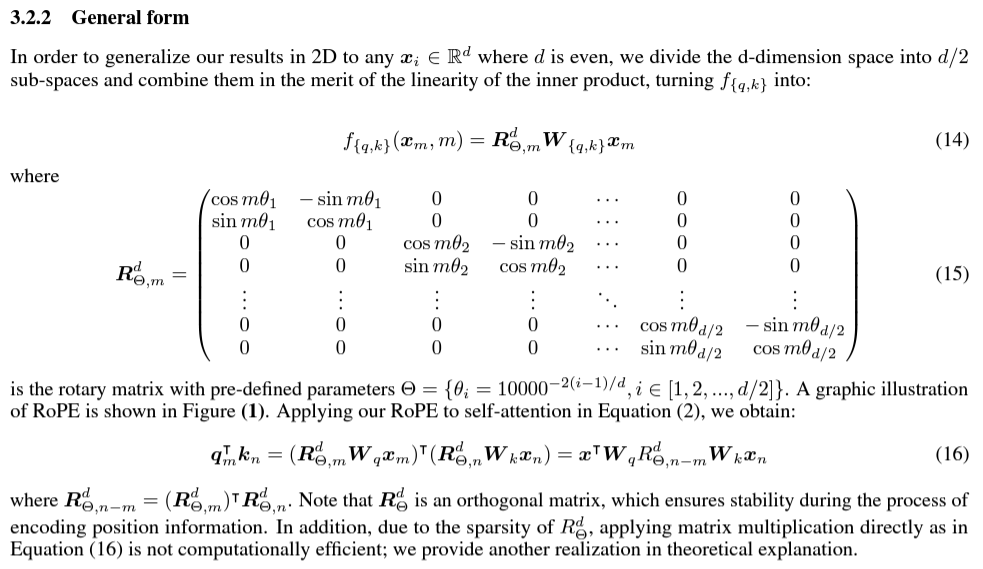
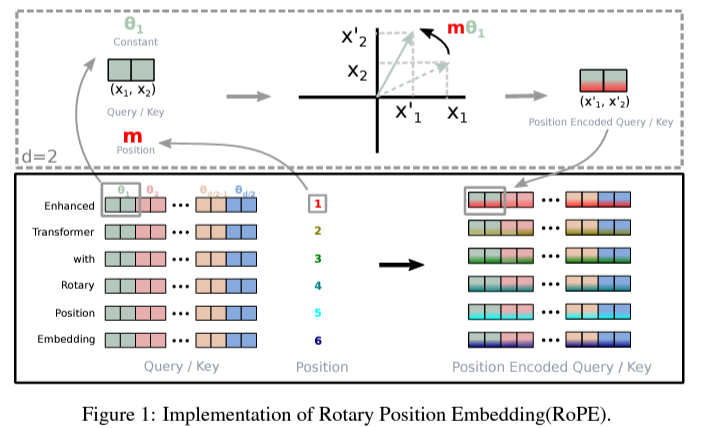
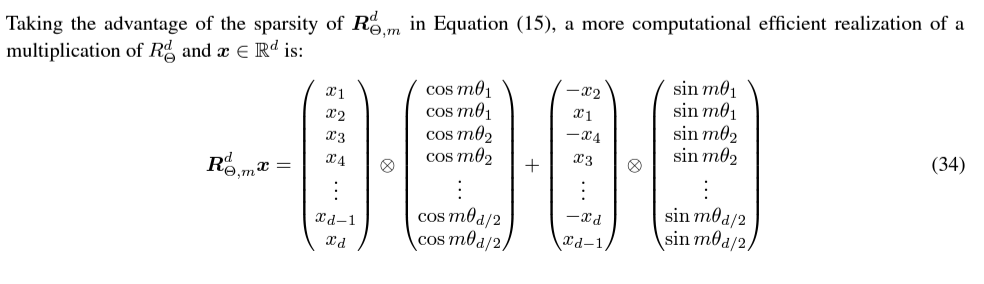

# Rotary Positional Embedding: [[paper]](https://arxiv.org/pdf/2104.09864v5.pdf)
* Let
  
* We need the transformation functions above ($f_q$ and $f_k$), such that they satisfy the below equation, the resultant function should encode **relative** position information
  
  
  

* 
  

## Also See
* [Reference-1](https://github.com/ZhuiyiTechnology/roformer/tree/main?tab=readme-ov-file#implementation)
* [Reference-2](https://github.com/facebookresearch/llama/blob/ef351e9cd9496c579bf9f2bb036ef11bdc5ca3d2/llama/model.py#L80C1-L161C50)

* 
* 
